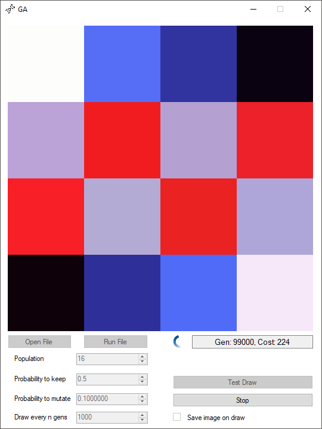

# GA_Image

A program that uses a genetic algoritm to evolve populations random RGB noise into a target image.

Written in C# using Visual Studio 2015.
  

### Build

<a href="/Build/GA_Image.exe">/Builds/GA_Image.exe</a>

Note: You may need to unblock the executable: Right click the exe -> Properties, and in the bottom section click the Unblock checkbox and then click OK.

### Source

<a href="/GA_Image">/Source</a>

### Screenshots

### Notes
Contains bugs: An educational project only    
Can be set to save very many images in the build direction. Use "Save image" option with caution.

###References
"Busy" animation generated at http://www.chimply.com/Generator
"DNA" icon made by Freepik from www.flaticon.com 

